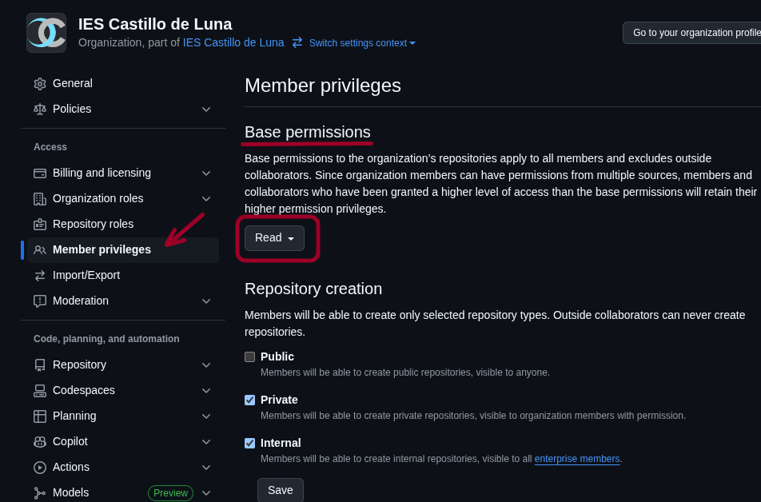
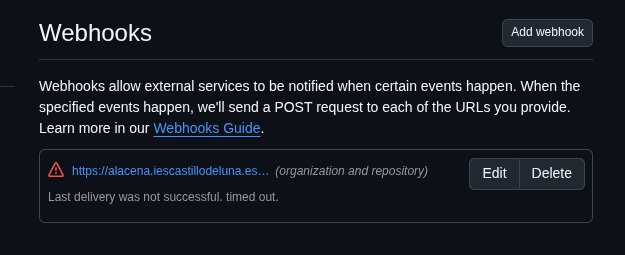
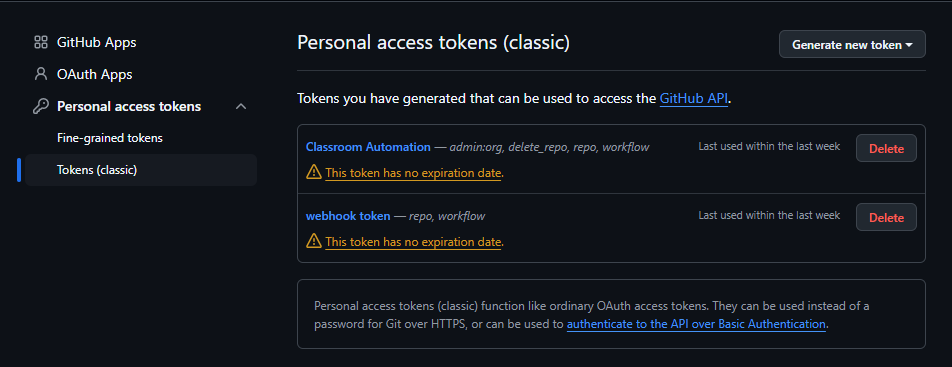
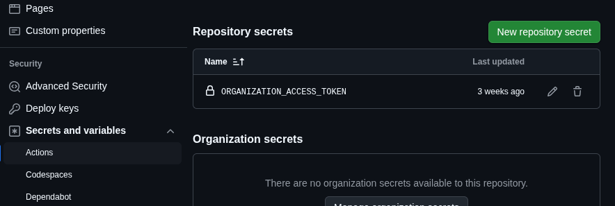

## Mantenimiento de la organización

La organización se orienta únicamente al uso de [GitHub
Classroom](https://classroom.github.com) por parte de profesores y alumnos. Para
ello se ha dejado toda la responsabilidad de administración a un único usuario;
y se han definido los profesores como miembros con el rol de *member* y permisos
de lectura:

> **Nota**  
> En principio, los miembros no tienen absolutamente ningún permiso por lo que
> habrá que cambiarlo al modo en que se ve en la captura, si se quiere que los
> profesores, sin llegar a definirse con el rol *owner*, sean capaces de usar
> *GitHub Classroom*.

### ¿Qué puede hacer un profesor?

Esta definición permite a los profesores exclusivamente:

a. Crear sus propios repositorios sobre los que tendrá automáticamente permiso
   de administración.
a. Revisar con permiso de lectura el resto de repositorios, incluidos los de sus
   alumnos; pero sin posibilidad de alterarlos o eliminarlos.
a. Crear tareas en la aulas de *Classroom* en las que se le haya inscrito como
   Administrador.
a. Eliminar alguna de las tareas anteriores, lo que implica indirectamente
   eliminar los repositorios de los alumnos asociados a dicha tarea.

> **Nota**  
> Los profesores no tienen potestad para crear nuevas aulas en la organización:
> simplemente serán capaces de ver y gestionar aquellas en las que el
> propietario de la organización lo haya habilitado como administrador del
> aula.

### Repositorios problemáticos

En GitHub, los repositorios se acomulan en la organización sin posibilidad de
clasificarse, lo cual supone que, si no se lleva ningún control, se vayan
acomulando repositorios que ya sean inútiles:

1. **Repositorios creados por profesores**:
   Para tareas que utilicen una plantilla como base para los repositorios de
   alumno, el profesor debe definir el propio repositorio de plantilla. Este
   repositorio puede ser ajeno a la organización, pero en tal caso deberá ser
   público, por lo que lo más probable es que se defina dentro de la
   organización. Un profesor descuidado puede ir acomulando repositorios y
   repositorios sin preocuparse en eliminarlos cuando ya no los necesite.

1. **Repositorios base**
   Cuando un profesor define una tarea basada en una plantilla, los repositorios
   de cada alumno no se basan en la plantilla misma, sino que se crea un nuevo
   repositorio que es copia de la plantilla y es éste el que se toma como base.
   Este repositorio intermedio es creado por el bot del *GitHub Classroom* y
   será necesario mientras exista el aula que lo toma como base. Al borrarse la
   tarea, este repositorio base no se elimina (a diferencia de los repositorios
   de estudiante que sí lo hacen) y, además, el profesor tampoco podrá hacerlo
   de forma manual, puesto que no es su creador.

> **Nota**  
> También existen los **repositorios de estudiante**, esto es, aquellos que se
> crean automáticamente cada vez que un estudiante acepta una tarea y le sirven
> para resolverlas. Pero estos repositorios se eliminan automáticamente cuando
> se elimina la tarea a la que están asociados, por lo que no suponen ningún
> problema.

### Workflows de mantenimiento

Para que el administrador no tenga que encargarse manualmente de estas penosas
tareas, se han programado en este repositorio algunos *workflows*:

1. De la gestión de los **repositorios base** se encargan dos:

   * [template-repo-register.yaml](.github/workflows/), que apunta en un archivo JSON la creación
     de cada *repositorio base*.
   * [template-repo-watcher.yaml](.github/workflows/), que periódicamente comprueba si el
     repositorio base sigue siendo útil y, si no es así, se encarga de
     borrarlo y eliminarlo del archivo JSON de registro. Además, comprueba, si
     los repositorios registrados realmente existen o si hay alguno que existe
     pero no está registrado. Por otro lado, si es deseo del administrador,
     puede forzarse su ejecución inmediata.

   No se consideran más circunstancias (renombrado, borrado manual, etc.), porque
   los profesores no pueden manipular estos repositorios y el administrador
   se debería abstener de tocarlos y limitarse únicamente a comprobar si el
   *watcher* realiza bien su trabajo.

1. De la gestión de los **repositorios creados por los profesores** se encargan
   más *workflows*, ya que sobre estos repositorios sí puede actuar su
   profesor-creador y, en consecuencia, hay más casuística:

   * [member-repo-register.yaml](.github/workflows/member-repo-register.yaml),
     que apunta en un archivo JSON la creación de cada repositorio de miembro.
   * [member-repo-deregister.yaml](.github/workflows/member-repo-deregister.yaml),
     que lo desapunta en caso de que se borre manualmente.
   * [member-repo-renamer.yaml](.github/workflows/member-repo-renamer.yaml), que
     actualiza el archivo cuando uno de los repositorios cambia de nombre.
   * [member-repo-remover.yaml](.github/workflows/member-repo-remover.yaml), que
     lista y borra todos los repositorios de un miembro, esto último sólo en caso
     de que éste no exista. Puede ejecutarse manualmente o ser invocado por
     [member-remove-trigger.yaml](.github/workflows/member-remove-trigger.yaml),
     el cual se desencadena cuando se elimina un miembro de la organización.
   * [member-repo-watcher](.github/workflows/member-repo-watcher), que
     periódicamente comprueba si el archivo de registro refleja los repositorios
     de miembro que realmente hay en la organización para corregir errores de
     ejecución de los anteriores. Puedem además, ejecutarse manualmente.

Los *workflows* se han definido en el repositorio *.github* de la organización,
aunque puede usarse otro con cualquier otro nombre.

### Webhook

Gran parte de los eventos se originan a través de un
[webhook](https://docs.github.com/es/webhooks/about-webhooks) definido para la
organización:

Este *webhook* ejecuta un *script* ubicado en un servidor externo, el cual a su
vez envía un mensaje a GitHub para que se ejecute el *workflow* correspondiente.
El *script* se ha escrito en PHP y se encuentra dentro del directorio ``php``.
Para su ejecución, además, se necesita que el servidor web defina dos variables
de ambiente:

* ``GITHUB_TOKEN``, que es el *token* necesario para que el *script* pueda
    mandar de vuelta un evento personalizado a GitHub.
* ``GITHUB_SECRET``, que es el secreto que se define al definir el webhook y
    sirve para que nadie indiscriminadamente use el *script* para manipular los
    repositorios de nuestra organización.

> **Nota**  
> En el archivo ``config.inc`` se puede modificar el nombre del repositorio en
> el que se alojan los *workflows*.

### Tokens

Para la correcta ejecución de los *workflows*, el administrador debe definir en
su perfil personal dos *tokens* personales de acceso:

El primero que se ve en la captura, que tiene habilitado el scope *workflow* es
el que debe usar el script del servidor web, mientras que el segundo, con más
permisos es el que usan los *workflows* del repositorio de configuración
(``.github`` en nuestro caso) y debe utilizarse para definir un **secreto** en
dicho repositorio:

### Otros documentos

* [Guía del profesor](docs/GuiaProfesor.md)
* [Guía del administrador](docs/GuiaAdmin.md)
