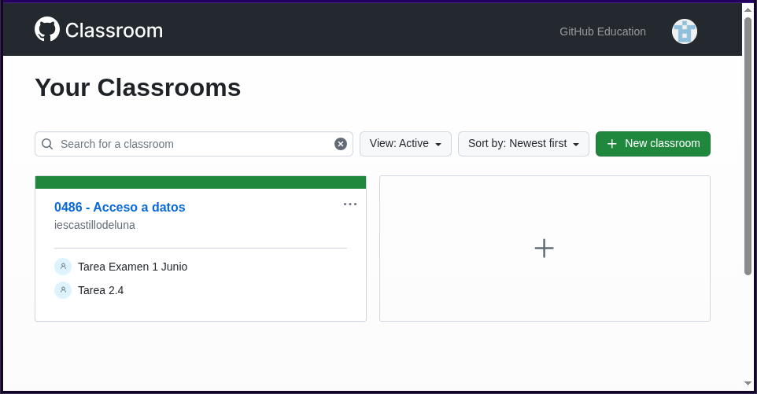

## Guía del profesor

### Solicitudes previas

Al comienzo del curso académico todo profesor que desee utilizar [GitHub
Classroom](https://classroom.github.com) como herramienta de enseñanza deberá
solicitar al administrador:

1. El registro como miembro en la organización en caso de que nunca lo hubiera
   hecho antes, preferentemente con una cuenta de GitHub asociada a los dominios
   ``g.educaand.es`` o ``iescastillodeluna.es``. En cualquier caso, no es
   imprescindible y el profesor puede solicitar la membresía con su cuenta
   habitual de GitHub, ya que ninguna actividad docente le requerira añadir
   repositorios a su cuenta personal.
1. Permisos de administración sobre las aulas que vaya a utilizar durante ese
   curso.

### Permisos

Completado lo anterior, el profesor podrá acceder a la [interfaz de GitHub
Classroom](https://classroom.github.com):

A diferencia de lo pueda parecer, no será capaz de añadir una nueva aula, ya que
de intentarlo, por no tener permisos de administración, se le invitará a crear
una nueva organización. Lo que sí podrá hacer es acceder a las aulas que les
hayan sido asignadas:

### Gestión del aula

La operativa básica dentro de un aula es la de crear tareas para que los
estudiantes puedan ir resolviéndolas. Antes, no obstante, es mejor definir qué
estudiantes participarán en nuestro curso.

#### Estudiantes

La interfaz permite añadir una lista de usuarios, en principio, sin relación
alguna con una cuenta de correo electrónico o de GitHub:

La utilidad de esta lista es que, al aceptar nuestros alumnos la primera tarea
con su cuenta de GitHub, podremos asociar dichas cuentas a cada uno de los
estudiantes que hayamos definido en la lista; y eso establecerá relación
duradera entre la lista y las cuentas de GitHub.

#### Tareas

Cada vez que tengamos intención de marcar una nueva tarea a los alumnos, podemos
definir una tarea en el aula. El proceso de creación de la tarea es muy
sencillo, pero conviene aclarar algunos aspectos:

+ Los *workflows* de mantenimiento. salvo por una excepción que citaremos más
  adelante, no exigen un formato al nombre de la tarea, pero se recomienda por
  consistencia que todos los nombres empiecen por "Tarea ": ``Tarea 1.5``,
  ``Tarea adicional 3``, etc.

+ Una tarea genera un *enlace de suscripción* que hay que facilitar a los
  alumnos que queremos sumar a ella. Tal suscripción no es automática, aunque
  los tengamos ya registrados como [estudiantes del aula](#Estudiantes).

+ La aceptación de una tarea supone para el alumno la creación de un repositorio
  en la organización, no en su perfil personal, y éste será según los
  configuremos durante su creación:

  - Son repositorios privados (aunque puede decirse lo contrario) y así los
    querremos habitualmente para que no puedan copiarse entre ellos.
  - En principio, el alumno sólo tendrá permisos de escritura para poder hacer
    entregas (o sea, ``push``), pero se le pueden dar permisos de
    administración.
  - Los profesores sólo tendrán permisos de lectura sobre estos repositorios por
    los permisos predeterminados que se han concedido a su rol de miembros
    (véase el [README](../README.md)).
  - Se crean vacíos, pero si asignamos a la tarea [una plantilla](#Plantillas)
    se tomará esta como referencia y el repositorio inicialmente partirá de los
    contenidos que tenga la plantilla.

+ Por acción de los *workflows* de la organización cuando se crea una tarea con
  plantilla, los repositorios de estudiante creados tendrá protegida su rama
  principal para que no puedan realizarse operaciones de *push* sobre ella y se
  creará una rama llamada "*desarrollo*" para que el alumno escriba su solución
  en ella. El objetivo de esto es que la rama principal siempre contenga el
  enunciado original. La protección no se llevará a cabo en caso de que:

  - Comience el nombre de la tarea por "*TareaNP *".
  - Se concedan al alumno en el repositorio permisos de administración.

### Plantillas

El profesor puede definir un repositorio como plantilla para generar los
repositorios de estudiantes asociados a una tarea. Así podría incluir una serie
de archivos iniciales y un ``README.md`` con el enunciado de la tarea. Debe
tenerse en cuenta que:

+ El repositorio debe estar marcado como plantilla en su configuración, de lo
  contrario no podrá ser utilizado como tal.

+ Puede crearlo en la propia organización (el profesor tiene permisos para crear
  repositorios privados dentro de la organización) o en cualquier otro lugar
  siempre que el repositorio sea accesible, esto es, público.

+ Los repositorios de estudiante se crearán a partir del estado que tuviera la
  plantilla en el momento de la creación, por lo que modificar la plantilla a
  posteriori no afectará a ningún repositorio de estudiante. Esto es debido a
  que, en el momento de la creación de la tarea, el *bot* crea una copia de la
  plantilla y es esta copia la que se usa como base para la creación de los
  repositorios de estudiante. Esta copia aparece como repositorio en la
  organización, pero el profesor no tiene permisos de escritura sobre ella.

> **Nota**  
> Es conveniente que el profesor lleve un control de estos repositorios de
> plantilla, y que los vaya eliminando según dejen de serle útiles. Las
> acciones de mantenimiento están atentos a ellos, pero sólo los eliminarán cuando
> el profesor abandone la organización.
